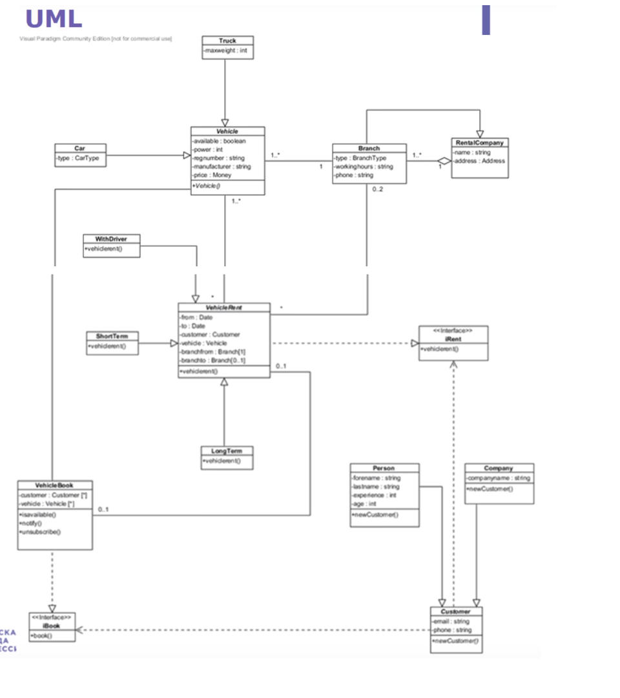
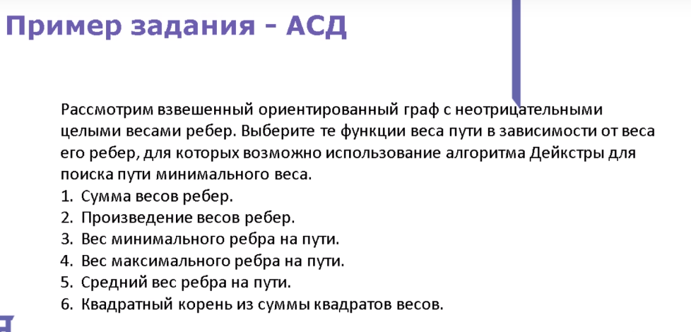

### Подготовка к олимпиаде yandex 

1. Разбор заданий из ролика https://www.youtube.com/watch?v=tA5gOGez8x4

    **Задания 1**:
    Клиент (Customer) с помощью этой системы может арендовать (Rent) транспортное средство (Vechicle). Клиенты бывают двух видов: частные(Person) и корпоративные (Company). Клиентам доступны три различных вида аренды: на короткий период(ShortTerm), длительный период(LongTerm) и с водителем (WithDriver).
    Клиент может забронировать (Book) транспортное средство. В этом случае, до момента взятия в аренду этого транспортного средства клиенту будут приходить оповещения, например, о том, забронированное транспортное средство стало недопуступным или вновь появилось в доступе.

    Требуется найти на диаграмме  и отметить все используемые паттерны проектирования из предложенного перечня:

    1. Посетитель
    2. Одиночка
    3. Наблюдатель
    4. Мост
    5. Стратегия
    6. Model-view-controller (MVC)
    7. Абстрактная фабрика
    8. Фабричный метод

    Ответ: Наблюдетель = VechicleBook, Абстрактная фабрика = VechilaRent,
    Фабричный метод = Customer

2. Разбор заданий из ролика https://www.youtube.com/watch?v=gVdpYZcJYlI

    Теория по алгоритмам на сайтах:
    + http://e-maxx.ru/algo/
    + http://neerc.ifmo.ru/wiki/index.php?title=%D0%97%D0%B0%D0%B3%D0%BB%D0%B0%D0%B2%D0%BD%D0%B0%D1%8F_%D1%81%D1%82%D1%80%D0%B0%D0%BD%D0%B8%D1%86%D0%B0

    **Задания 1**:
    
    АСД - это [абстрактно синтаксическое дерево](https://ru.wikipedia.org/wiki/%D0%90%D0%B1%D1%81%D1%82%D1%80%D0%B0%D0%BA%D1%82%D0%BD%D0%BE%D0%B5_%D1%81%D0%B8%D0%BD%D1%82%D0%B0%D0%BA%D1%81%D0%B8%D1%87%D0%B5%D1%81%D0%BA%D0%BE%D0%B5_%D0%B4%D0%B5%D1%80%D0%B5%D0%B2%D0%BE)

