# Подготовка к олимпиаде yandex 

# Вебинары по "Программирование и информационные технологии"

## Разбор заданий из 1-ого вебинара проведенного 11.10.2018 https://www.youtube.com/watch?v=tA5gOGez8x4

**Задание 1**:
Клиент (Customer) с помощью этой системы может арендовать (Rent) транспортное средство (Vechicle). Клиенты бывают двух видов: частные(Person) и корпоративные (Company). Клиентам доступны три различных вида аренды: на короткий период(ShortTerm), длительный период(LongTerm) и с водителем (WithDriver).
Клиент может забронировать (Book) транспортное средство. В этом случае, до момента взятия в аренду этого транспортного средства клиенту будут приходить оповещения, например, о том, забронированное транспортное средство стало недопуступным или вновь появилось в доступе.

Требуется найти на диаграмме  и отметить все используемые паттерны проектирования из предложенного перечня:

1. Посетитель
2. Одиночка
3. Наблюдатель
4. Мост
5. Стратегия
6. Model-view-controller (MVC)
7. Абстрактная фабрика
8. Фабричный метод

Ответ: Наблюдетель = VechicleBook, Абстрактная фабрика = VechilaRent,
Фабричный метод = Customer

## Разбор заданий из 2-ого вебинара проведенного 31.10.2018 https://www.youtube.com/watch?v=gVdpYZcJYlI

Теория по алгоритмам на сайтах:
+ http://e-maxx.ru/algo/
+ http://neerc.ifmo.ru/wiki/index.php?title=%D0%97%D0%B0%D0%B3%D0%BB%D0%B0%D0%B2%D0%BD%D0%B0%D1%8F_%D1%81%D1%82%D1%80%D0%B0%D0%BD%D0%B8%D1%86%D0%B0

**Задание 1**:

АСД - это [абстрактно синтаксическое дерево](https://ru.wikipedia.org/wiki/%D0%90%D0%B1%D1%81%D1%82%D1%80%D0%B0%D0%BA%D1%82%D0%BD%D0%BE%D0%B5_%D1%81%D0%B8%D0%BD%D1%82%D0%B0%D0%BA%D1%81%D0%B8%D1%87%D0%B5%D1%81%D0%BA%D0%BE%D0%B5_%D0%B4%D0%B5%D1%80%D0%B5%D0%B2%D0%BE)

UDP: Алгоритм Дейкстры в рекомендованных выше ссылках не нашёл, поэтому ссылка на [wiki](https://ru.wikipedia.org/wiki/%D0%90%D0%BB%D0%B3%D0%BE%D1%80%D0%B8%D1%82%D0%BC_%D0%94%D0%B5%D0%B9%D0%BA%D1%81%D1%82%D1%80%D1%8B)
Ответ: 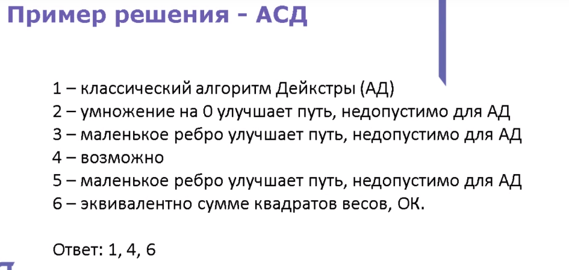

## Разбор заданий из 3-его вебинара проведенного 22.11.2018 https://www.youtube.com/watch?v=YXaG8wGqNGY

# Вебинары по "Бизнес-информатика"

- [Запись от 01.10.2018](https://www.youtube.com/watch?v=U0Ws5aTjbls)
- [Запись от 19.10.2018](https://www.youtube.com/watch?v=Rozkr_OnyEc)
- [Запись от 09.11.2018](https://www.youtube.com/watch?v=NsVhZW_elfc)

**Задание 1**:
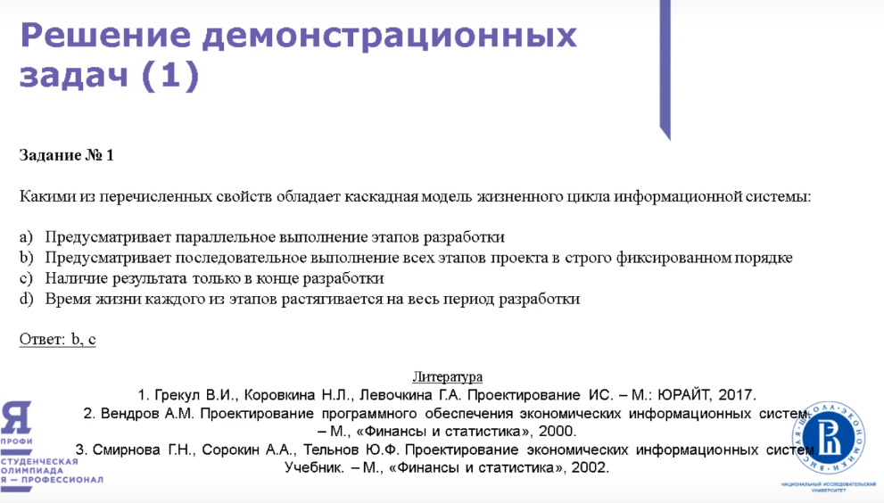
[Описание каскадной модели разработки](https://habr.com/ru/post/111674/)

**Задание 2**:
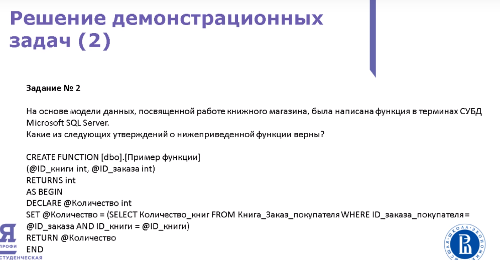
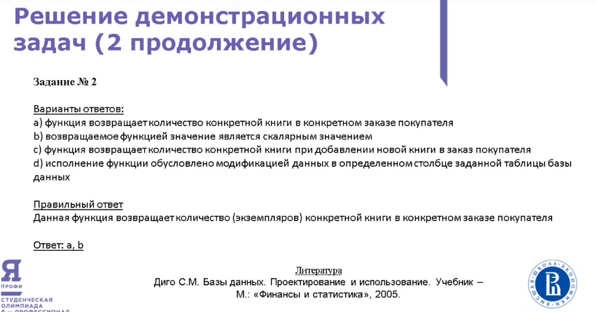
[скалярное значение](https://otvet.mail.ru/question/51150282)
**Задание 3**:
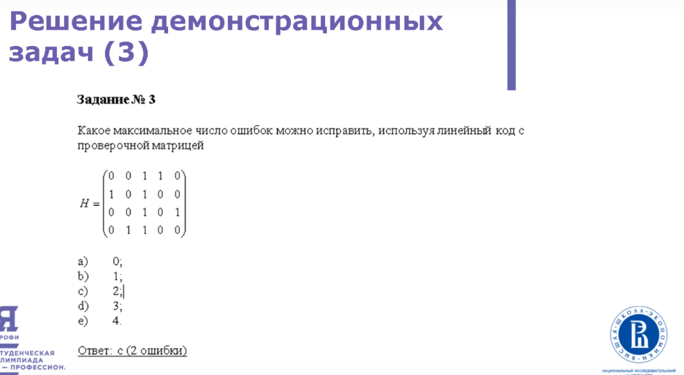
**Задание 4**:
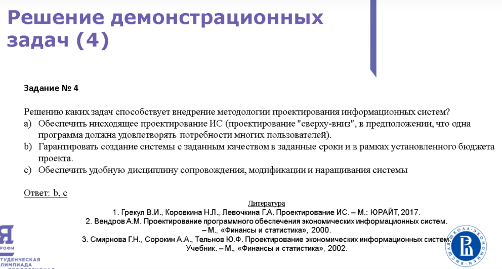
**Задание 5**:
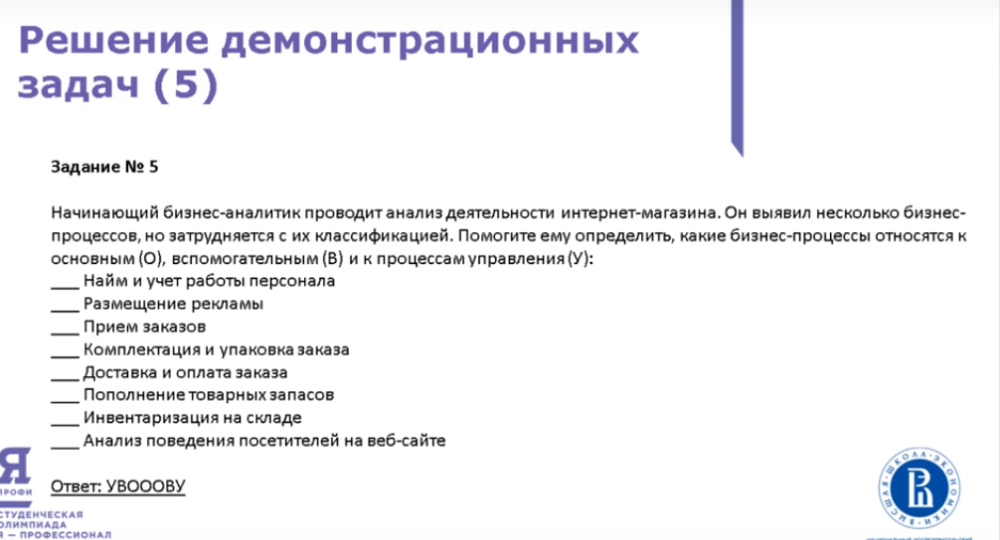
[Бизнес процессы](https://ru.wikipedia.org/wiki/%D0%91%D0%B8%D0%B7%D0%BD%D0%B5%D1%81-%D0%BF%D1%80%D0%BE%D1%86%D0%B5%D1%81%D1%81)
**Задание 6**:
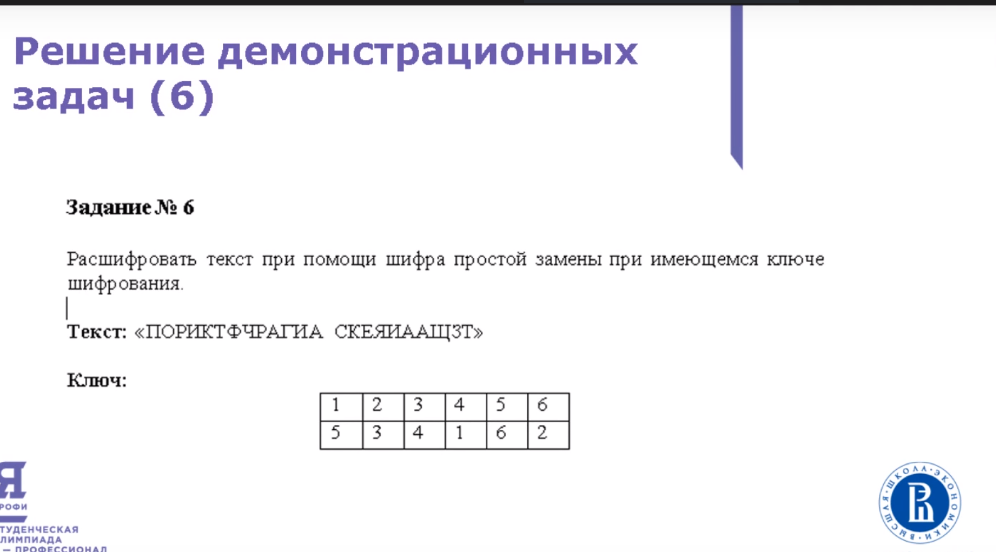
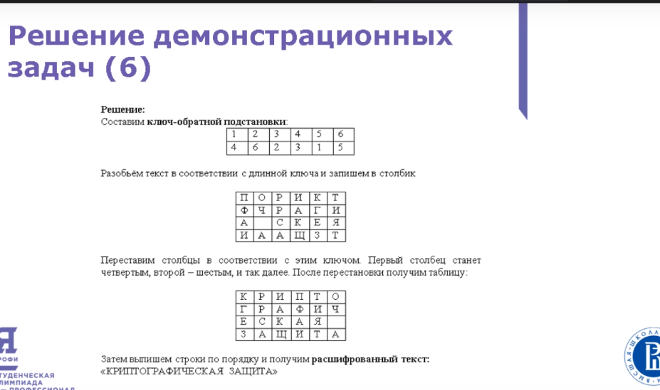
**Задание 7**:
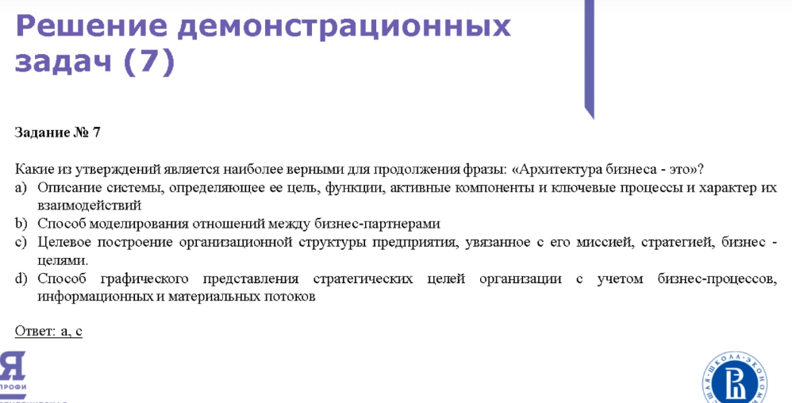
**Задание 8**:
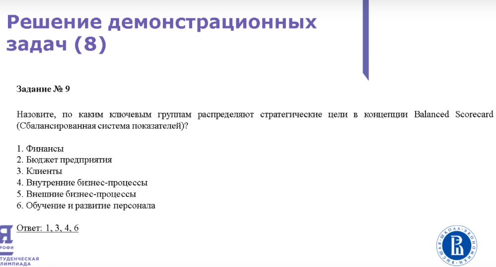
**Задание 9**:
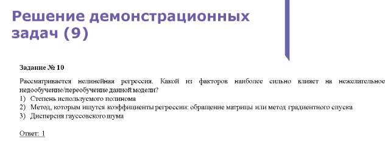
**Задание 10**:
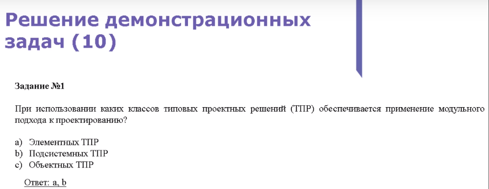
[Типовое проектирование ИС](https://www.intuit.ru/studies/courses/2195/55/lecture/1622?page=4)

**Задание 11**:
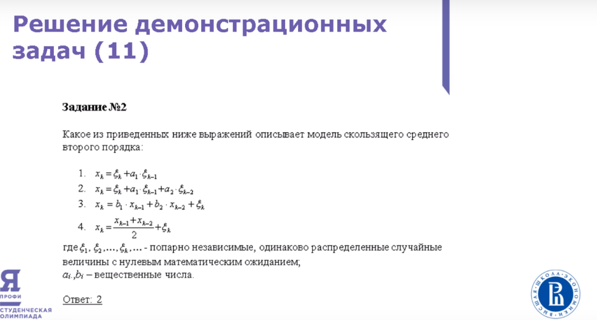
[Скользящее среднее используется для для сглаживания краткосрочных колебани й является одним из видов свётки.](https://ru.wikipedia.org/wiki/%D0%A1%D0%BA%D0%BE%D0%BB%D1%8C%D0%B7%D1%8F%D1%89%D0%B0%D1%8F_%D1%81%D1%80%D0%B5%D0%B4%D0%BD%D1%8F%D1%8F)

**Задание 12**:
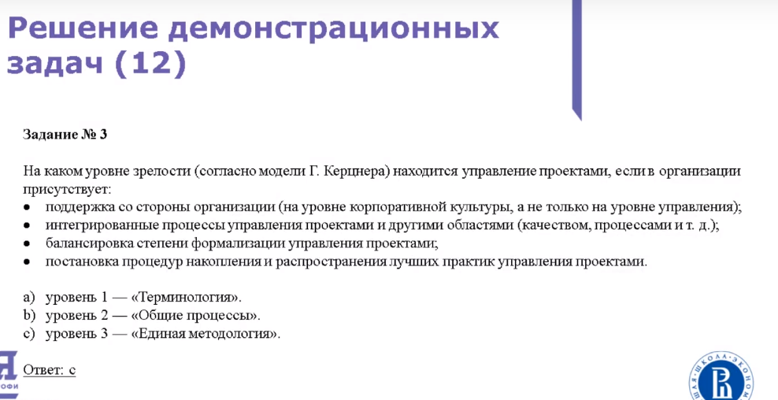
[Модель Г.Керцнера](https://cyberpedia.su/11x5f10.html)

**Задание 13**:
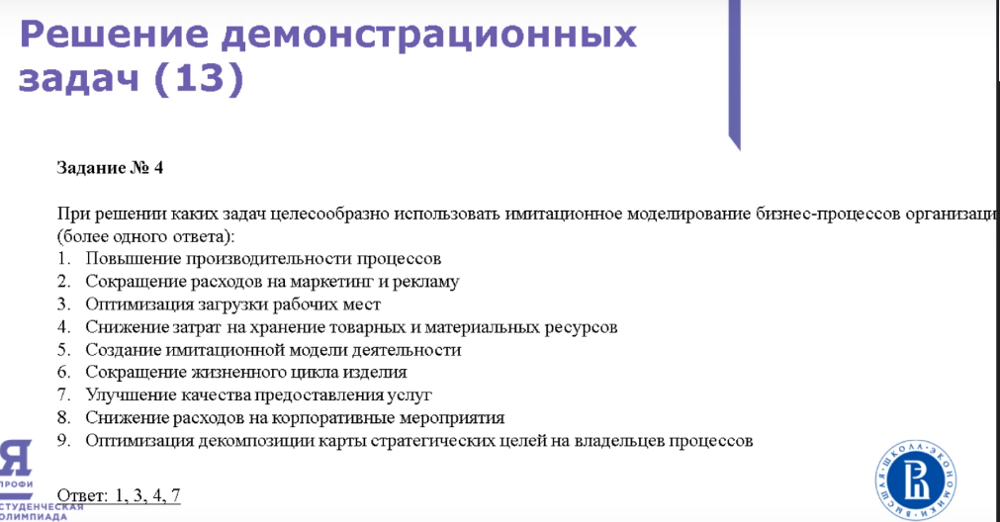
**Задание 14**:
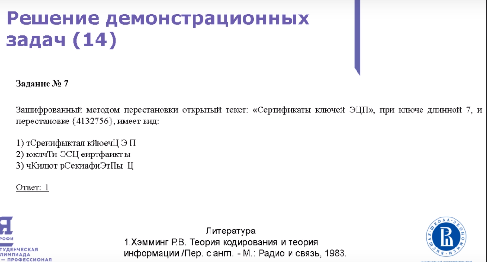
**Задание 15**:
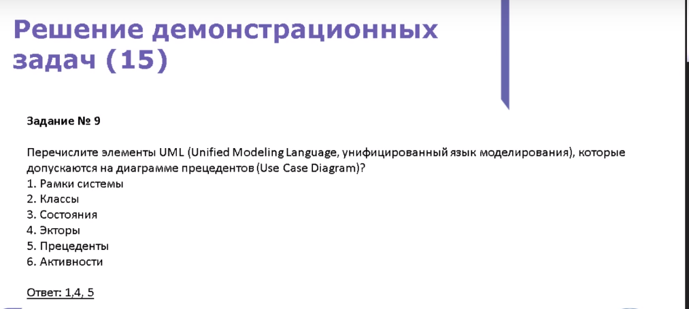

## [Перечень курсов](recommends/COURSES.md), имея сертификат по которым, можно пропустить первый отборочный этап олимпиады: "Я профессионал"