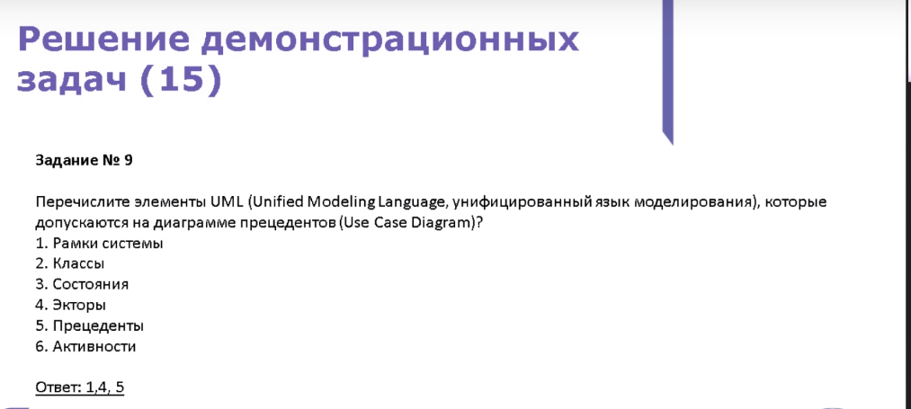

# Вебинары по "Бизнес-информатика"

- [Запись от 01.10.2018](https://www.youtube.com/watch?v=U0Ws5aTjbls)
- [Запись от 19.10.2018](https://www.youtube.com/watch?v=Rozkr_OnyEc)
- [Запись от 09.11.2018](https://www.youtube.com/watch?v=NsVhZW_elfc)

# Разбор заданий с вебинара от записи 09.11.2018

**Задание 1**:

[Описание каскадной модели разработки](https://habr.com/ru/post/111674/)

**Задание 2**:

[скалярное значение](https://otvet.mail.ru/question/51150282)
**Задание 3**:

**Задание 4**:

**Задание 5**:

[Бизнес процессы](https://ru.wikipedia.org/wiki/%D0%91%D0%B8%D0%B7%D0%BD%D0%B5%D1%81-%D0%BF%D1%80%D0%BE%D1%86%D0%B5%D1%81%D1%81)
**Задание 6**:

**Задание 7**:

**Задание 8**:

**Задание 9**:

**Задание 10**:

[Типовое проектирование ИС](https://www.intuit.ru/studies/courses/2195/55/lecture/1622?page=4)

**Задание 11**:

[Скользящее среднее используется для для сглаживания краткосрочных колебани й является одним из видов свётки.](https://ru.wikipedia.org/wiki/%D0%A1%D0%BA%D0%BE%D0%BB%D1%8C%D0%B7%D1%8F%D1%89%D0%B0%D1%8F_%D1%81%D1%80%D0%B5%D0%B4%D0%BD%D1%8F%D1%8F)

**Задание 12**:

[Модель Г.Керцнера](https://cyberpedia.su/11x5f10.html)

**Задание 13**:

**Задание 14**:

**Задание 15**:
